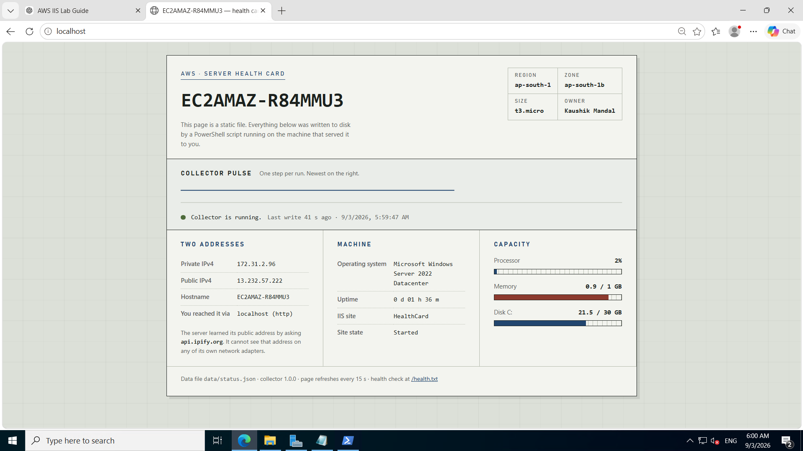
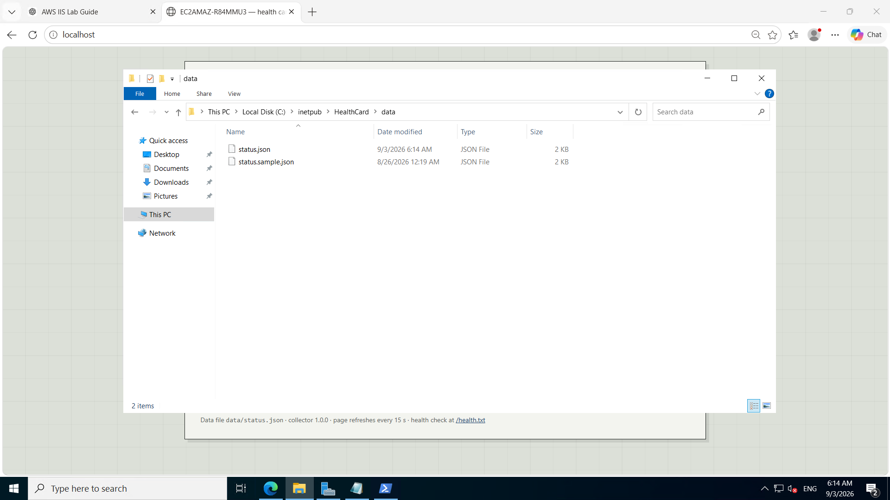
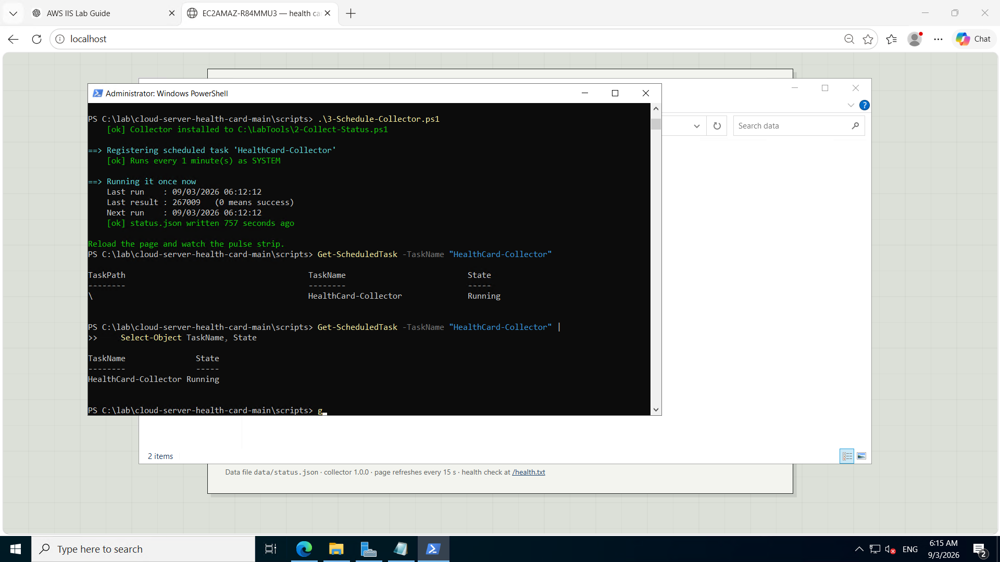
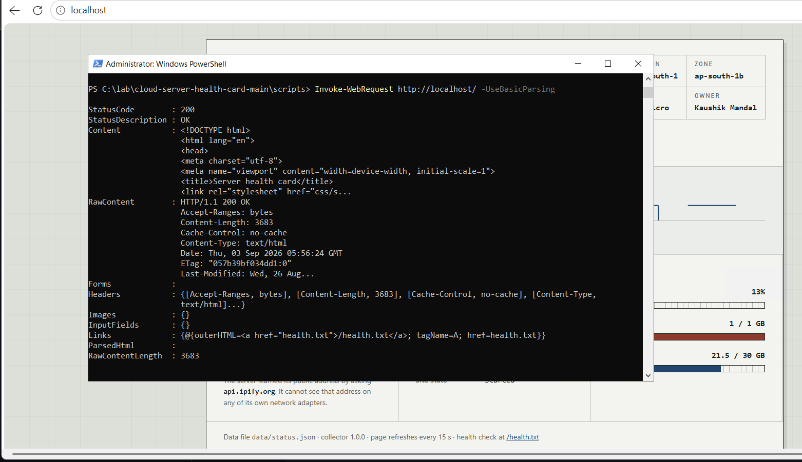
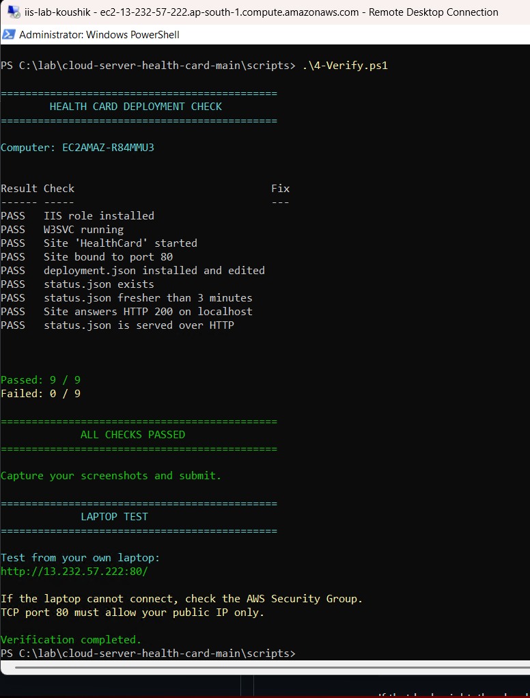
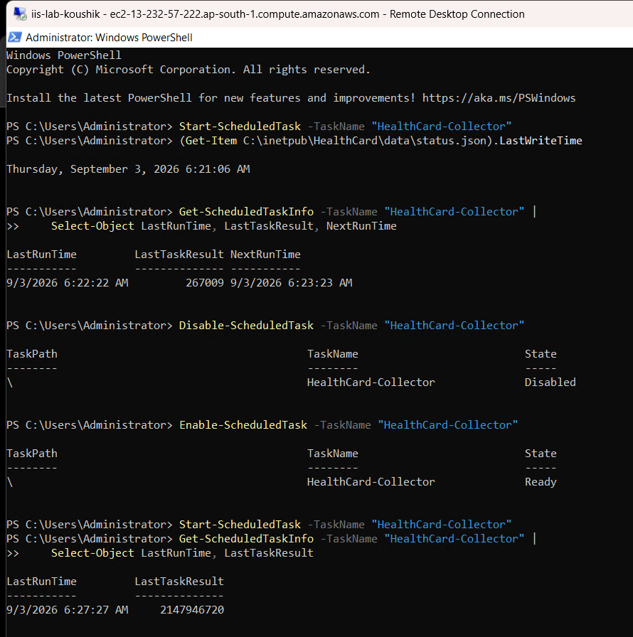

# Server Health Card — deploy a self-reporting website to IIS

**Runs identically on AWS, Azure and GCP.**
Time: 60–75 minutes · Level: beginner cloud / Windows admin · Free tier eligible on all three.

---

## Table of Contents

- [What you are building](#what-you-are-building)
- [Why this works on all three clouds](#why-this-works-on-all-three-clouds)
- [What you will learn](#what-you-will-learn)
- [Step 0 — Create the VM](#step-0--create-the-vm)
- [Step 1 — Install IIS and publish the site](#step-1--install-iis-and-publish-the-site)
- [Step 2 — Collect the status](#step-2--collect-the-status)
- [Step 3 — Give it a heartbeat](#step-3--give-it-a-heartbeat)
- [Step 4 — Reach it from your laptop](#step-4--reach-it-from-your-laptop)
- [Step 5 — Verify, then break it](#step-5--verify-then-break-it)
- [Deployment Result](#deployment-result)
- [Verification](#verification)
- [Screenshots](#screenshots)
- [Submission](#submission)
- [Clean up — do this or you will be billed](#clean-up--do-this-or-you-will-be-billed)
- [Troubleshooting](#troubleshooting)
- [Optional challenges](#optional-challenges)
- [Repository contents](#repository-contents)

---

## What you are building

A Windows Server VM in the cloud that **serves a live report about itself**.

A PowerShell script on the machine collects its hostname, IP addresses, OS, uptime and resource usage, and writes the result to a JSON file inside the IIS web root. A scheduled task re-runs it every 60 seconds. IIS serves the file as ordinary static content, and the page renders it — with a heartbeat strip showing every collector run.

Open the public IP from your laptop and the server tells you which machine you reached, in which cloud and region, and how healthy it is right now.

**You are not writing a website.** The HTML, CSS and JavaScript are finished and you should not need to change them. Your work is the cloud and Windows layer.

---

## Why this works on all three clouds

The scripts use **no cloud API and no cloud SDK**. They read what Windows already knows, and for the one thing Windows does *not* know — its own public IP address — they ask an outside service.

The only cloud-specific step is creating the VM and opening the ports. That lives in **[docs/CLOUD-SETUP.md](docs/CLOUD-SETUP.md)**, which has all three side by side.

---

## What you will learn

| Concept | Where |
|---|---|
| VM creation, sizing, and getting an admin password | Step 0 |
| Cloud firewalls — security groups, NSGs, VPC rules | Step 0, Step 4 |
| Windows Firewall as a second, separate layer | Step 1, Step 4 |
| IIS role, sites, bindings, application pools | Step 1 |
| Why the server cannot see its own public IP | Step 2 |
| Why outbound works but inbound needs rules | Step 2 |
| Task Scheduler, the SYSTEM account, boot triggers | Step 3 |
| What survives a reboot, and what survives a stop/start | Step 5 |

---

## Step 0 — Create the VM

Follow **[docs/CLOUD-SETUP.md](docs/CLOUD-SETUP.md)** for your cloud, then come back here. You should be looking at a Windows Server desktop over RDP.

**Checkpoint 1:** screenshot the Windows desktop with Server Manager open.

---

## Step 1 — Install IIS and publish the site

Open PowerShell **as Administrator** (right-click Start → *Windows PowerShell (Admin)*).

Get the files onto the server. Server 2022 ships with a locked-down browser, so use PowerShell:

```powershell
New-Item -Path C:\lab -ItemType Directory -Force
Invoke-WebRequest -Uri 'https://github.com/shubhambanik696/cloud-server-health-card/archive/refs/heads/main.zip' `
                  -OutFile C:\lab\lab.zip -UseBasicParsing
Expand-Archive C:\lab\lab.zip -DestinationPath C:\lab -Force
cd C:\lab\cloud-server-health-card-main
Set-ExecutionPolicy -Scope Process -ExecutionPolicy Bypass
```

**Edit `deployment.json` first.** The server cannot work out which cloud it is in, which region, or who owns it — you have to tell it:

```powershell
notepad .\deployment.json
```

Fill in `cloud`, `region`, `zone`, `machineSize` and `owner` with the values you noted in Step 0. Save and close.

Now run the setup:

```powershell
cd scripts
.\1-Setup-IIS.ps1
```

The script installs IIS, opens port 80 in Windows Firewall, copies the site to `C:\inetpub\HealthCard`, creates a dedicated app pool and site, and requests the page locally to prove it works.

On the server, browse to `http://localhost`. **You will see the page with an error at the bottom** — `HTTP 404 requesting data/status.json`. That is correct: the site is live but nothing has collected anything yet.

**Checkpoint 2:** screenshot IIS Manager (Server Manager → Tools) showing `HealthCard` started on port 80.

---

## Step 2 — Collect the status

```powershell
.\2-Collect-Status.ps1 -Verbose
```

Refresh `http://localhost`. The card fills in.

Now the part worth thinking about. Run this:

```powershell
ipconfig
```

Your VM has a private address — something like `10.x`, `172.x` or `192.168.x`. **The public IP address is nowhere in that output.** The machine genuinely does not know it. That address belongs to the cloud provider's network layer, which rewrites packets on the way in and out.

So how did the page get it? The collector asked an outside service what address its request appeared to come from. Try it yourself:

```powershell
Invoke-RestMethod https://api.ipify.org
```

Notice what that outbound call required: **nothing**. No firewall rule, no configuration. But the inbound request from your laptop needed a rule in the cloud firewall *and* a rule in Windows Firewall. Cloud networks are open outbound and closed inbound by default, and that asymmetry is deliberate.

**Checkpoint 3:** screenshot the card showing your real hostname and both IP addresses.

---

## Step 3 — Give it a heartbeat

```powershell
.\3-Schedule-Collector.ps1
```

The task runs as **SYSTEM**, so it survives logoff and needs no stored password, and it has an at-startup trigger so the page recovers on its own after a reboot.

Open **Task Scheduler** and find `HealthCard-Collector`. Look at its Triggers and History tabs.

Leave the page open for five minutes. The pulse strip fills in from the right, one step per run.

Now break it on purpose:

```powershell
Disable-ScheduledTask -TaskName 'HealthCard-Collector'
```

Wait three minutes. The page keeps loading perfectly — it just tells you the data is stale. That distinction between *the web server is up* and *the data is current* is the entire premise of monitoring. Re-enable it:

```powershell
Enable-ScheduledTask -TaskName 'HealthCard-Collector'
```

**Checkpoint 4:** screenshot the pulse strip with at least five steps.

---

## Step 4 — Reach it from your laptop

Open `http://<your-vm-public-ip>/` in your own browser.

If it times out, work outward and stop at the first failure — that is where the problem is:

| # | Test | If it fails |
|---|---|---|
| 1 | `Invoke-WebRequest http://localhost` **on the server** | IIS itself. See Troubleshooting. |
| 2 | `Invoke-WebRequest http://<private-ip>` **on the server** | Site binding or the site is stopped. |
| 3 | `Test-NetConnection <public-ip> -Port 80` **from your laptop** | A firewall — but which one? |
| 4 | Browser to `http://<public-ip>` | Cache, or you typed `https`. |

**If step 3 fails**, you have two firewalls to choose between. Check the Windows one first, since it is quick:

```powershell
Get-NetFirewallRule -DisplayName 'Lab HTTP 80 In' | Select DisplayName, Enabled, Direction
```

If that looks right, the cloud firewall is the problem — go back to your security group, NSG, or VPC firewall rule.

Then confirm on the page: the **You reached it via** row shows the public IP, while **Private IPv4** shows something completely different. One machine, two addresses, and it only knows about one of them.

**Checkpoint 5:** screenshot the page loading from your laptop, URL bar visible.

---

## Step 5 — Verify, then break it

```powershell
.\4-Verify.ps1
```

Nine checks, each with a fix hint. Get them all to PASS.

**Checkpoint 6:** screenshot the all-PASS output.

Then two experiments:

1. **Reboot the VM.** Wait two minutes, reconnect to the same address. Everything comes back on its own — IIS because its service is automatic, the collector because of the at-startup trigger.
2. **Stop the VM, then start it again.** On AWS and GCP the public IP has changed. On Azure it probably has not. The hostname and private IP are the same everywhere.

---

## Deployment Result

- Windows Server deployed on AWS EC2
- IIS configured to host the HealthCard site
- PowerShell collector generates `data/status.json`
- Scheduled Task runs the collector automatically
- The health card displays server information and resource usage
- `4-Verify.ps1` successfully checks the deployment

---

## Verification

The deployment was verified locally through IIS and automatically validated using the `4-Verify.ps1` PowerShell script. The verification process checks the following 9 key components:

1. IIS role
2. W3SVC service
3. HealthCard site
4. Port binding
5. deployment.json
6. status.json
7. status.json freshness
8. HTTP 200 response
9. status.json HTTP access

The automated verification script confirmed a final result of **Passed: 9 / 9** and **Failed: 0 / 9**, confirming that all deployment requirements were fully met.

---

## Screenshots

The screenshots below provide proof of the deployment and verification steps.

### 1. HealthCard Web Interface Running on Localhost


This screenshot proves that the HealthCard web application is active and reachable on `http://localhost`. It displays real-time server information, including hostname (`EC2AMAZ-R84MMU3`), region (`ap-south-1`), IP addresses (Private: `172.31.2.96`, Public: `13.232.57.222`), Windows Server OS details, IIS site status, and system capacity metrics.

### 2. Status Data File (status.json) Generation

This screenshot proves that the PowerShell status collector successfully generates the `status.json` file inside the IIS web root directory (`C:\inetpub\HealthCard\data`). This JSON file serves as the dynamic data source rendered by the HealthCard web interface.

### 3. Automated Scheduled Task Setup

This screenshot proves the successful registration and activation of the `HealthCard-Collector` scheduled task via `3-Schedule-Collector.ps1`. The task is configured to run every minute under the `SYSTEM` account to keep server status data current.

### 4. IIS Web Server Local Response Verification

This screenshot proves that IIS is properly serving the website locally, returning an HTTP `200 OK` response status when requested via `Invoke-WebRequest http://localhost/`. It confirms web server responsiveness and default document rendering.

### 5. Automated Verification Script Execution (4-Verify.ps1)

This screenshot proves that all deployment checks passed successfully when running `4-Verify.ps1` inside the AWS EC2 Remote Desktop session. The script confirmed a result of `Passed: 9 / 9` and `Failed: 0 / 9` across all IIS, task, status file, and HTTP response checks.

### 6. Collector Scheduled Task Execution and Control Testing

This screenshot proves manual control and timestamp verification of the `HealthCard-Collector` task using PowerShell cmdlets (`Start-ScheduledTask`, `Disable-ScheduledTask`, `Enable-ScheduledTask`). It confirms that triggering the task updates the `LastWriteTime` timestamp of `status.json` and verifies task state toggles.

---

## Submission

1. Screenshots for Checkpoints 1–6
2. Written answers:
   - Your VM has a public IP address. Why does `ipconfig` not show it?
   - The outbound call to `api.ipify.org` needed no firewall change, but your laptop's inbound request needed two rules. Why is the default asymmetric?
   - Name the two firewalls you configured. What happens if you open port 80 in only one?
   - Why does the scheduled task run as SYSTEM rather than as Administrator?
   - After stop/start, what changed and what stayed the same — and why?
   - Name one thing you had to do in your cloud's console that would have been different in the other two.

---

## Clean up — do this or you will be billed

Delete the VM **and** its disk and public IP address. On Azure, delete the whole resource group — it is the only reliable way to catch every attached resource.

A small VM left running costs roughly $8–15 a month. A forgotten one over a semester is a real bill.

---

## Troubleshooting

**"running scripts is disabled on this system"**
`Set-ExecutionPolicy -Scope Process -ExecutionPolicy Bypass` — reverts when you close the window.

**"The term '.\1-Setup-IIS.ps1' is not recognized"**
You are in the wrong folder, or you dropped the leading `.\`. PowerShell needs both.

**HTTP 500.19**
`web.config` is malformed. Restore it from the repo.

**HTTP 403.14 — directory listing denied**
`index.html` is not directly inside `C:\inetpub\HealthCard`. GitHub's ZIP adds a `-main` folder — check you did not copy one level too high.

**HTTP 404.3 on `data/status.json`**
IIS has no MIME type for `.json`. The repo `web.config` fixes this; you probably deleted or replaced it.

**Page says "HTTP 404 requesting data/status.json"**
The collector has never run. `.\2-Collect-Status.ps1 -Verbose`

**Page shows old data no matter how often I refresh**
Check the file on the server, not the browser:
`(Get-Item C:\inetpub\HealthCard\data\status.json).LastWriteTime`
Old file → the scheduled task is the problem. Fresh file → hard-refresh with `Ctrl+F5`.

**Public IP shows "not available"**
Outbound HTTPS is blocked, or the VM has no public address. Test with `Invoke-RestMethod https://api.ipify.org`.

**Task result `0x1`**
The script threw. Run it exactly as the task does, to see the error:
`powershell.exe -NoProfile -ExecutionPolicy Bypass -File C:\LabTools\2-Collect-Status.ps1 -Verbose`

**Task result `0x41303`**
"Has not run yet." Wait for the trigger, or `Start-ScheduledTask -TaskName 'HealthCard-Collector'`.

**It worked yesterday, today the address is dead**
You stopped and started the VM and it has a new public IP. That is Step 5 happening to you by accident.

---

## Optional challenges

1. **Second port.** Re-run setup with `-Port 8080 -SiteName HealthCardDev`. Open 8080 in both firewalls. Explain what a binding actually is.
2. **Static address.** Reserve a static public IP (Elastic IP / Azure Public IP / GCP static external IP) and attach it. Stop and start the VM. Explain what changed and what it costs.
3. **Read the logs.** Find the IIS logs under `C:\inetpub\logs\LogFiles\`. Write a one-liner that counts requests per client IP.
4. **HTTPS.** Create a self-signed certificate with `New-SelfSignedCertificate`, bind it to 443, open 443 in both firewalls. Explain why the browser still warns.
5. **Golden image.** Create an image from your configured VM (AMI / Azure image / GCP machine image), launch a second VM from it, and open both cards side by side. Same everything, different hostname. That is the point of an image.
6. **Two clouds, one class.** Deploy the identical package on a second cloud and put the two cards side by side. The pages are byte-identical. Write down every difference you hit before reaching that point.

---

## Repository contents

```
cloud-server-health-card/
├── README.md                    this file
├── deployment.json              EDIT THIS — your cloud, region, zone, size, name
├── site/                        published to IIS — do not edit
│   ├── index.html
│   ├── web.config               default document, JSON MIME type, cache policy
│   ├── health.txt
│   ├── css/style.css
│   ├── js/app.js
│   └── data/status.sample.json
├── scripts/                     identical on AWS, Azure and GCP
│   ├── 1-Setup-IIS.ps1
│   ├── 2-Collect-Status.ps1
│   ├── 3-Schedule-Collector.ps1
│   └── 4-Verify.ps1
└── docs/
    ├── CLOUD-SETUP.md           Step 0 for all three clouds
    └── INSTRUCTOR-NOTES.md
```
